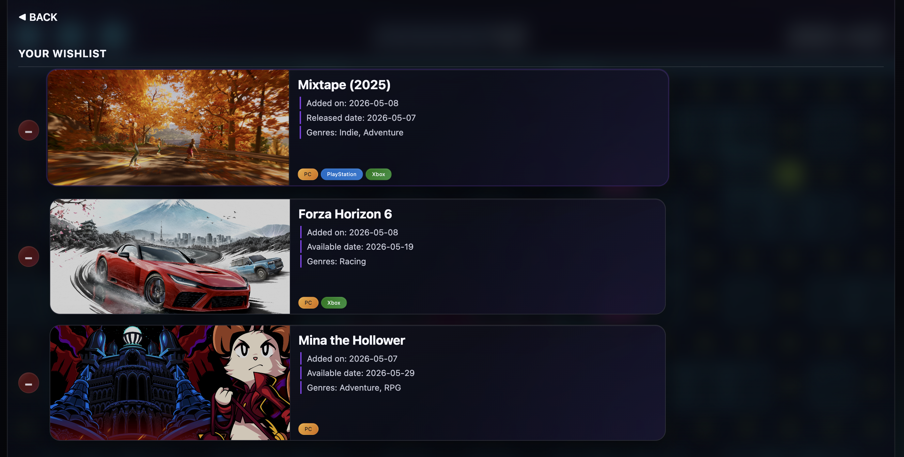

# GA SEB Unit 2 - Project WhatToGame

An interactive **React** application that showcases the **latest games** from major gaming platforms such as **PC**, **PlayStation**, **Nintendo**, and **Xbox**, with **wishlist functionality** for managing user preferences.

## About WhatToGame

As a gamer myself, knowing **latest releases** and to keep a wishlist **across platforms** is something that I wanted. Which was why I've created this simple app to do just that.

Information is pulled from **[RAWG Video Games Database API](https://rawg.io/apidocs)**.

And as an added **EasterEgg**, I've added an **OP Monster Widget** that links to the **[OP Monster game page](https://leslietan1981.github.io/GA-Unit1-Project-OPmon/)**. What better flavour than to add my own game!

## The app

WhatToGame is built to be simple. The Splash page features a dashboard with widgets for the wishlist as well as a featured game widget.

#### Wishlist widgets:

- Total games: A widget that displays the total number of games currently saved in the wishlist. Click on this widget brings you into the wishlist details section.

- Genres: A Widget that displays the genres of the games saved in your wishlist.

- Latest addition: The latest game added to your wishlist.

#### Featured game widget:

- Featured game: A widget that features OP Monster. The idea is that this widget can be changed to feature other games as well.

## Current Features

- View wishlist in a summary as wishlist widgets.
- Add and Remove games from the wishlist.
- OP Monster game demo snippet created in React.
- Simple bot logic from OP Monster.
- Games information pulled from public API (RAWG).
- Airtable as the backend to READ and WRITE wishlist data.

## Planning

1. The most important part of this project was to find a public API that can be used without jumping through proxy hoops.
2. Features and information was then planned around what was available from the API.
3. Next, services to READ and WRITE data were created. This was crucial for seeing the actual returned data and plan workarounds needed if issues or limitations arises.
4. The App was then created with the intention to break down parts into small React components to easily manage the scope for the features.
5. The main components include, Latest games listing, Wishlist widgets, Wishlist manager and Featured game widget.
6. Lastly, the code was tested → fixed → refactored, before it was finally built and deployed.

## Attributions

- **[RAWG Video Games Database API](https://rawg.io/apidocs)**: a free public API with 500,000+ games available in their database.
- **[Airtable](https://airtable.com/)**: a cloud-based, low-code platform that combines the simplicity of a spreadsheet with the power of a relational database.
- **Copilot** was used to enhance the final visuals of the React app.

## Tech Stack

The project production was driven by **limiting myself** to the skills, knowledge and tools that I have **acquired in Unit 1 and 2**.

And with that, the technologies I used were:

- **HTML:** Base layout structure
- **CSS:** Re-skinable visual styles
- **ReactJS:** User interface and logic

## Next Steps

Here are some features that are interesting to add:

- Rearrange wishlist order
- Filter games in wishlist by platforms / genres
- Recommend games based on games saved in wishlist
- UI improvements for clearer navigation
